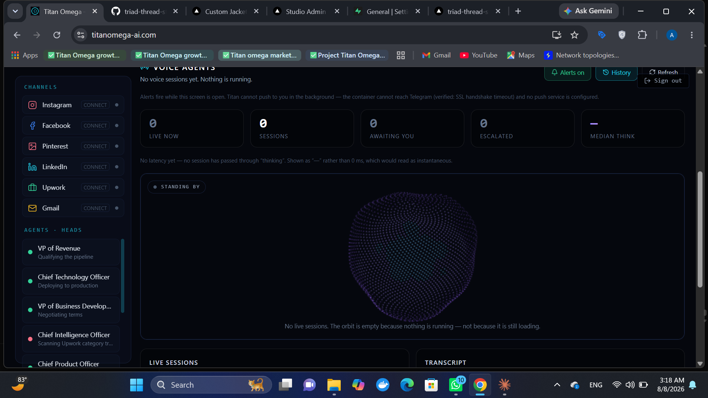

<div align="center">

# TITAN Ω

**SEO, local ranking and legal compliance — audited for any business, in any jurisdiction.**
Multi-tenant platform with a voice-agent layer, built solo on a $0 stack.

[**titanomega-ai.com**](https://titanomega-ai.com) · [Start free](https://titanomega-ai.com/join) · [Pricing](https://titanomega-ai.com/pricing) · Try the cockpit from the sign-in screen, no signup
Built by [Abdullah Rathore](https://github.com/AbdullahRathoreVA)


</div>

---

## What it sells

Add a website. Titan crawls it and returns a technical, local and **legal** audit —
scored separately, never averaged — then a client-ready PDF.

The legal check is the differentiator: **Impressum / §5 DDG, GDPR consent, and
cookie disclosure across 9 jurisdictions**. It is a defect a business owner
cannot argue with, and it is included **in full on the free tier** — hiding the
one finding that proves the product's value would sell nothing.

16 verticals. `wholesale` and `manufacturer` are correctly `local_business=False`,
because a B2B buyer finds a supplier by searching the product, never by proximity.

## Every subscriber gets the whole cockpit

Signing up opens the same sixteen-tab cockpit the founder runs — the boot and
voice, the 3D universe, agents, War Room, CRM, Finance, Voice, Telegram, Job
Radar — scoped to that subscriber's own data.

It is served through one door, `/api/me`, behind an allowlist
(`backend/app/core/cockpit_scope.py`). A route is unreachable there until it is
added on purpose, together with a test that proves it reads only that
account's workspace. Two tests keep it honest as the product grows: one fills
the founder's data with marker values and fails if any subscriber route ever
returns one; the other walks every client call in `frontend/lib/api.ts` and
fails if a button a subscriber can press reaches a closed route.

The public demo is that cockpit too, on a read-only demo account holding
Titan's own demonstration businesses.

## The rule the whole codebase is built on

**No number is shown unless it was measured.**

- Cost is `null`, never `$0.00` — a zero under a currency symbol claims a
  measurement nobody took.
- Latency is `null` when no session passed through `thinking`; `0 ms` would read
  as instantaneous.
- An unaudited client site shows *not audited*, never `0` beside a real `58`.
- The funnel labels each step by **source** — steps rebuilt from durable account
  state are true for every account ever created; steps that can only come from
  the activity log say so, because a zero there means *not observed*, not
  *never happened*.
- Forecasting **refuses** to project on thin data.

## Voice Agent OS



A validated state machine — `idle · listening · thinking · speaking ·
interrupted · escalated · ended` — that **refuses illegal transitions** (409).
A dashboard cannot honestly animate a state the agent was never in.

- **Sensitive tools block on human approval.** Booking, paying, emailing,
  calling and deleting land `pending`; executing one without an approver
  returns **403**. Not a convention — a state the store enforces.
- **Session replay** — transcript, tool-call timeline, state history.
- **Speech reactivity is honest.** Browsers don't expose synthesized speech to
  the audio graph, so while Titan speaks the avatar is driven by real
  `onboundary` word events. The microphone path is a true FFT. The UI says
  which is driving. Faking a waveform would be inventing a measurement.
- The particle avatar uses **no 3D library** — plain canvas and arithmetic, so
  it adds nothing to the bundle and runs on integrated graphics.

## Founder-only intelligence

Who signed up, which plan, what they actually did — plus visitor analytics
measured **in-process**: no Google Analytics, no third-party script, no cookie,
no consent banner, no bill.

Privacy is the design constraint, not a footnote: Titan sells legal compliance,
so **visitor IPs are never stored** — only a hash with a salt that rotates every
24h. Referrers are reduced to a host before storage. Crawler hits are counted
separately and never folded into human traffic.

That costs something, and the report admits it: unique visitors is a **per-day**
figure only, so there is no honest all-time total to divide signups by. It ships
**no conversion percentage** rather than inventing the denominator.

## Lead discovery → audit → draft

Search the web, drop the junk, file real businesses as CRM leads, audit their
sites, draft outreach citing what was actually found.

The value is in what gets thrown away. Directories are not leads — filed as one,
Titan would audit `alibaba.com` and draft outreach about Alibaba's SEO. A
certifier's supplier-profile page is not the supplier. Deduplication is by
registrable domain, because one company appears three times in a single search.

**Nothing is ever sent.** A test asserts the module has no send capability at all.

## Titan audits itself

Every 6 hours, with the same engine it sells, and publishes the score at
`/api/self-seo` — **currently 94/100, grade A**, up from 58/D. Anyone can claim
their SEO tool is good; a score produced by the code the customer is buying can
be checked by the reader in seconds. If Titan regresses, that number falls in
public.

## Security

A test walks the **real route table** and fails on any endpoint serving real
data to a public demo visitor. It was written after `/api/admin/clients` was
found exposing real client names and contacts to anyone clicking "View the live
demo" — the guard fails *open*, so anything unregistered leaks. That test has
caught four endpoints since. It is never to be deleted.

Founder analytics and voice transcripts are refused outright to guests rather
than substituted: there is no demo-safe version of a subscriber's email address
or a caller's own words.

## Payments

Behind one adapter seam. **Paddle** is the processor in use — a Merchant of
Record that handles sales tax and VAT, and one that onboards a Pakistan-based
seller. Checkout runs in Paddle's overlay; trials, upgrades and cancellations
arrive by webhook, verified against the `Paddle-Signature` HMAC, and a stale
or replayed event is refused. A paid plan is only ever set by a confirmed
payment. Dodo Payments and PayPal remain as adapters behind the same seam.

With no processor configured, signup and the free tier work normally and the
refusal names exactly which variables are missing. Titan never sees a card
number. Setup: [docs/PAYMENTS.md](docs/PAYMENTS.md).

## Engineering

- **722 backend tests**, run before every push, plus a mutation check
  (`python -m evaluation.mutation_check`) that deletes each guard in turn and
  fails if the suite still passes — a test that cannot fail protects nothing.
- **Self-healing AI layer** — Groq → Gemini → OpenRouter with live model-catalog
  discovery, so provider retirements can't silence it. Every credential
  whitespace-hardened. `/api/doctor` reports what the running container actually
  sees.
- **Measured model routing** — ranks providers on evidence, never drops one,
  reliability beats latency.
- **Reflection loop that closes** — six slow tasks moved the next plan's
  estimate from 3.5 s to 10.5 s.
- **One container** — Next.js static export served by FastAPI; GitHub Actions →
  Hugging Face Spaces auto-deploy behind a free Cloudflare Worker on the custom
  domain.
- **PWA** — installs on Android, iOS and Windows. $0 versus Apple's $99/yr.
- Every engine degrades honestly when a key is missing; no paid service is a
  hard dependency.

## Stack

`Python` `FastAPI` `Next.js 14` `TypeScript` `Tailwind` `three.js / react-three-fiber`
`framer-motion` `Web Speech API` `Web Audio` `SSE` `Tavily` `Paddle` `Docker` `HF Spaces`

## Run it yourself

```bash
# backend
cd backend && pip install -r requirements.txt
uvicorn app.main:app --reload --port 8000

# frontend (dev)
cd frontend && npm install && npm run dev

# frontend (production build served by FastAPI)
cd frontend && TITAN_STATIC=1 npm run build
```

`TITAN_STATIC=1` is required for the static export — a plain `npm run build`
produces the dev variant and leaves a stale `out/` in place.

Runs with no keys at all. Add `GROQ_API_KEY` for conversational AI,
`TAVILY_API_KEY` for lead discovery, and the `PADDLE_*` variables in
[docs/PAYMENTS.md](docs/PAYMENTS.md) for checkout. Tests:

```bash
cd backend && python -m pytest tests/ -q
cd frontend && npm run typecheck
```

## Status

Live and tested. Payments work end to end in Paddle's sandbox; the live account
is waiting on Paddle's review. **Earning nothing yet** — the gap is
distribution, not features.
